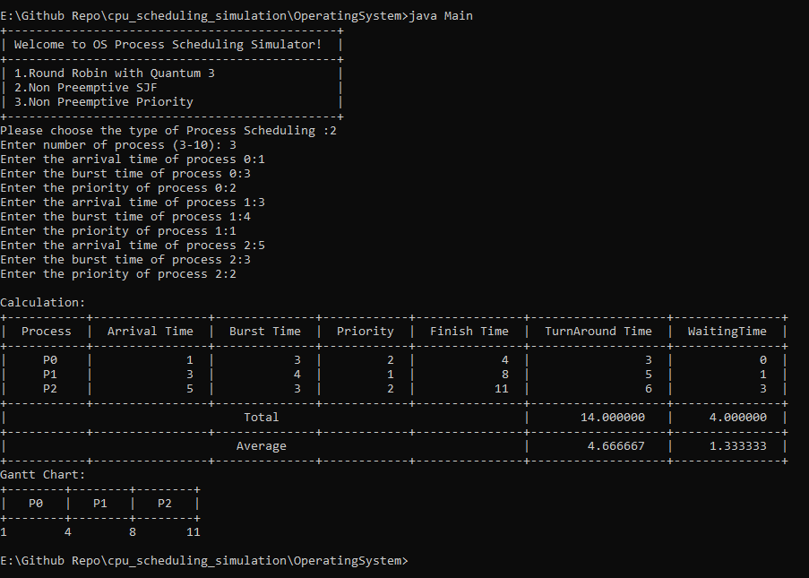
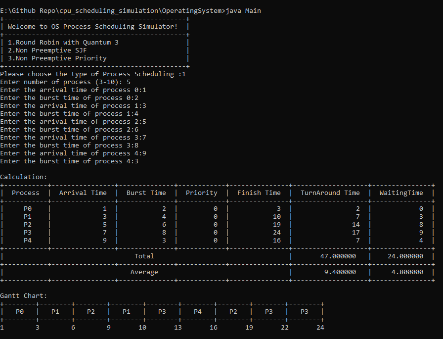

# cpu_scheduling_simulation
Simulation of CPU scheduling algorithms for my university assignment under Operating System subject

For more info, please refer to the documentation pdf file in the reference folder

# How to start the program?
1. Clone this repo
2. Make sure your machine can run java file, if not please install JDK via this [link](https://www.oracle.com/java/technologies/downloads/)
3. Navigate into OperatingSystem folder, run javac *.java and then javac Main.java to start the program

# Sample images of this app

